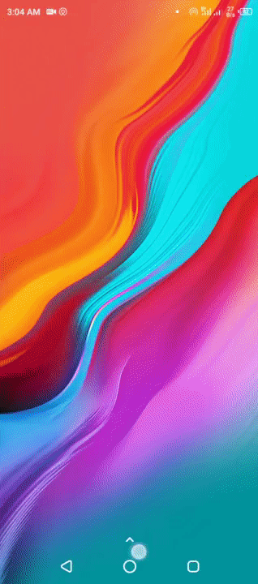

    
    <h1 align="center">QR Code   (Reader & Scanner)</h1>

# QR_CODE_Genrator_and_Reader
QR Code Reader App developed during '30 Days of Kotlin'  organised Google Devs India Event

    

## Developed By:

**Sahil Sheikh**
iamsahilsk99@gmail.com
